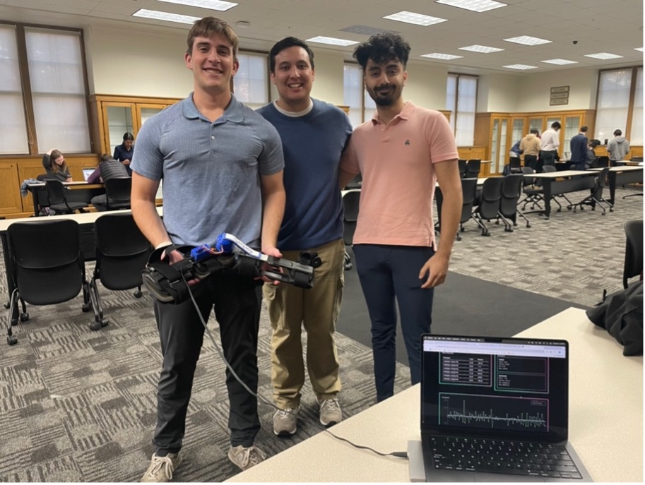

  <h1>KneeKarePro Production Release</h1>
  <h2><i>ACL Recovery Brace</i></h2>

[KneeKare README](https://github.com/KneeKarePro)

KneeCarePro is a brace for ACL recovery patients. The patient's brace will be able to upload their rotary data for a clinician to review.

<!-- Table of Contents -->
- [Overview](#overview)
- [User Experience](#ui)
  - [Interface](#interface)
  - [Navigation](#nav)
  - [Perception](#perception)
  - [Responsiveness](#resp)
- [Build Quality](#bq)
  - [Robustness](#robust)
  - [Consistency](#const)
  - [Aesthetic Rigor](#aes)
- [Features](#features)
  - [External Interface](#ext)
  - [Persistent State](#perstate)
  - [Internal Systems](#internal)

  <h2>Overview</h2>

The KneeKarePro is a brace for ACL recovery patients. The brace combines hardware and software to collect a patient's rotary data. The data is then uploaded to a web app for a clinician to review.

  <h2>User Experience</h2>

The production release of KneeKarePro was designed to maximize usability, ensuring that both clinicians and patients can interact with the system effortlessly. To achieve this, the team focused on simplifying the setup and operation of the device. The KneeKarePro module was made fully attachable, with clear assembly instructions provided to guide consumers through the process. This ensures that users can independently set up the device without requiring specialized technical knowledge.

On the software side, the frontend was designed to be straightforward and easy to navigate. The interface provides clearly labeled controls and intuitive data visualizations, making it accessible to users with varying levels of technical expertise. These features allow users to track their rehabilitation progress seamlessly and without confusion.

While the current production release does not include a dedicated mobile application, the framework developed during this phase lays a strong foundation for future app development. This addition, while technically straightforward, was deprioritized in favor of refining the existing features and ensuring a polished release.

The team's focus on creating a user-friendly experience ensures that the production release of KneeKarePro is intuitive, accessible, and effective for its intended users, supporting their rehabilitation goals with minimal barriers.

The user interaction with Knee Kare device was redesigned and pivoted to a persistent and easily accessible mode. The hardware and firmware were redesigned allowing for a more hands-off approach

  <h3> Interface </h3>

The production release of KneeKarePro features a polished and user-friendly interface designed to make interaction with the system straightforward and efficient. On the hardware side, the modular casing includes clear visual indicators and step-by-step assembly instructions, ensuring users can easily attach the device to standard knee braces without technical assistance.

The software frontend provides intuitive navigation, with clearly labeled controls and accessible features such as real-time angle measurements and CSV file downloads. Consistent visual cues highlight active states and guide users through their interactions, enhancing clarity and usability.

Every interface element was tested extensively to ensure it functions smoothly and meets user needs. While a mobile application is not yet available, the current web-based interface delivers all core functionalities reliably, supporting a seamless user experience.

  <h3> Navigation </h3>

The KneeKarePro production release includes a straightforward navigation system that provides users with the tools they need without unnecessary complexity. The web-based frontend offers two primary sections: one for clinicians and one for patients. This separation ensures that both user groups can easily access the features relevant to their needs.

The clinician section allows for real-time monitoring of patient data, including visualized progress and detailed reports. The patient section focuses on personal progress tracking and rehabilitation goals. Transitioning between these sections is seamless, with clear and accessible controls guiding users through the system.

While the navigation is simple, it effectively meets the project's goals by allowing users to quickly access their desired features with minimal effort. This design supports the project's emphasis on usability and ensures both clinicians and patients can achieve their objectives efficiently.

  <h3> Perception </h3>

The KneeKarePro production release prioritizes an intuitive user experience, ensuring that both patients and clinicians can interact with the system effectively and with confidence. Feedback from multiple rounds of user testing indicated that the device and interface were easy to understand and navigate, even for first-time users.

Sensory feedback plays a key role in enhancing the device's intuitiveness. For example, visual indicators confirm successful data uploads and downloads, while error messages provide clear instructions for resolving issues. These cues reduce user frustration and help maintain a seamless workflow. The separation between the clinician and patient sections also enhances clarity, as each user group is presented with information and features tailored to their specific needs.

User testing revealed that the system aligns well with user expectations, with participants noting its straightforward design and ease of access. Minor adjustments, such as refining labels and improving visual feedback for state changes, were implemented based on this feedback. These refinements ensure that the device supports users in achieving their rehabilitation goals with minimal effort or confusion.

By focusing on clear sensory feedback and intuitive design, the production release of KneeKarePro helps users feel confident and engaged in their rehabilitation journey, meeting its goal of providing an effective and frustration-free experience.

  <h3> Responsiveness </h3>

The production release of KneeKarePro is designed to ensure a responsive and straightforward user experience. The system reliably displays real-time data transmitted from the device without delays or interruptions. Users can connect to the local network seamlessly and access accurate knee angle measurements through the interface.

The simplicity of the interface ensures that users are presented with only the necessary information, reducing potential confusion. Real-time data updates occur smoothly, and the system has been thoroughly tested to eliminate errors or glitches. As a result, users can trust that the data displayed is accurate and consistent with their movements.

On the hardware side, data is logged and stored in real time, with seamless synchronization between the device and the frontend interface. The focus on reliability and simplicity ensures that both clinicians and patients can interact with the system without encountering technical difficulties or delays.
Through rigorous testing and attention to detail, the KneeKarePro system ensures a responsive and efficient experience, supporting the needs of its users without unnecessary complexity.

  <h2>Build Quality</h2>

The production release of KneeKarePro reflects a high standard of build quality, ensuring that the system is robust, consistent, and polished. Extensive testing and refinement were conducted to ensure that all components—both hardware and software—function seamlessly and reliably.

  <h3> Robustness </h3>

The device has been thoroughly tested to handle various edge cases, such as continuous use, inconsistent user input, and fluctuating data conditions. No crashes or glitches were observed during the production release testing, and the system gracefully manages unexpected scenarios, ensuring uninterrupted operation. Hardware durability was also verified, with the modular casing providing secure protection for internal components.

  <h3> Consistency </h3>

The system performs predictably across all use cases, delivering the same reliable results for identical inputs. Real-time data updates remain consistent, and the integration between hardware, backend, and frontend ensures that users experience a cohesive system without discrepancies or unpredictable behaviors.

  <h3> Aesthetic Rigor </h3>

The KneeKarePro device features a polished design, with a clean and professional aesthetic that aligns with its medical application. The modular casing was optimized to not only protect internal components but also blend seamlessly with standard knee braces. The frontend interface reflects the same attention to detail, presenting data in a clear and visually appealing manner.

The production release of KneeKarePro demonstrates the team's commitment to delivering a reliable, consistent, and well-designed system that meets the demands of ACL rehabilitation with a professional and polished final product.

  <h2> Features </h2>

The production release of KneeKarePro incorporates all essential functionalities, addressing user needs through a combination of robust external interfaces, persistent state management, and fully implemented internal systems. Below is a breakdown of the finalized features:

  <h3> External Interface </h3>

- **Clinician and Patient Interfaces**: The web-based frontend includes distinct sections for clinicians and patients. Clinicians can monitor patient progress with detailed data visualizations and reports, while patients can track their rehabilitation goals in real time.
-	**Modular Hardware Design**: The device attaches seamlessly to any standard knee brace, providing broad compatibility. Assembly is straightforward, with step-by-step instructions ensuring users can set up the device independently.
-	**Local Network Connectivity**: The system establishes a local network, allowing users to connect directly to the device without requiring internet access. This ensures reliable functionality in various environments.
-	**CSV Data Export**: Users can download rehabilitation data as a CSV file, making it easy to analyze progress or share data with clinicians.

  <h3> Persistent State </h3>

-	**Data Logging**: The ESP32 microcontroller logs time-stamped knee angle data to the SD card, ensuring data persistence even in the absence of a frontend connection.
-	**Data Synchronization**: The system automatically updates the frontend with the latest data stored on the SD card, ensuring that users always have access to accurate and up-to-date information.
-	**State Management**: Changes in user input or system status are reflected in real time, ensuring consistency between the device, backend, and frontend.

  <h3> Internal Systems </h3>

-	**Data Processing**: Real-time data captured by the potentiometer is processed by the ESP32 microcontroller and stored locally. This ensures accuracy and reliability before the data is transmitted to the frontend.
-	**Backend Integration**: The backend processes the stored data and provides API endpoints that support frontend functionality. This includes enabling CSV downloads and displaying visualizations.
-	**System Robustness**: All internal processes were tested extensively to handle edge cases, such as sudden disconnections or corrupted data. The system gracefully recovers from these scenarios without loss of functionality.

  <h2> Repositories </h2>

The following repositories are associated with the KneeKarePro project and are being actively developed:

- [Firmware](https://github.com/KneeKarePro/KneeKareProFirmware)
- [Hardware + STL](https://github.com/KneeKarePro/SebasHardware)
- [Data Streamer](https://github.com/KneeKarePro/bt_test)
- [Backend](https://github.com/KneeKarePro/KneeKareBackend)
- [Web Application](https://github.com/KneeKarePro/WebApp)

  <h2> Instructions </h2>

  <h2> Milestone Work </h2>

The following milestones have been completed for the KneeKarePro production release:

1. ### Firmware Refactor
The firmware for the Knee Kare device was redesigned to transmit sensor data over HTTP and a self-hosted access point. The refactor also move the firmware from an Arduino base to a FreeRTOS base allowing for a more reactive performance while utilizing more cores.